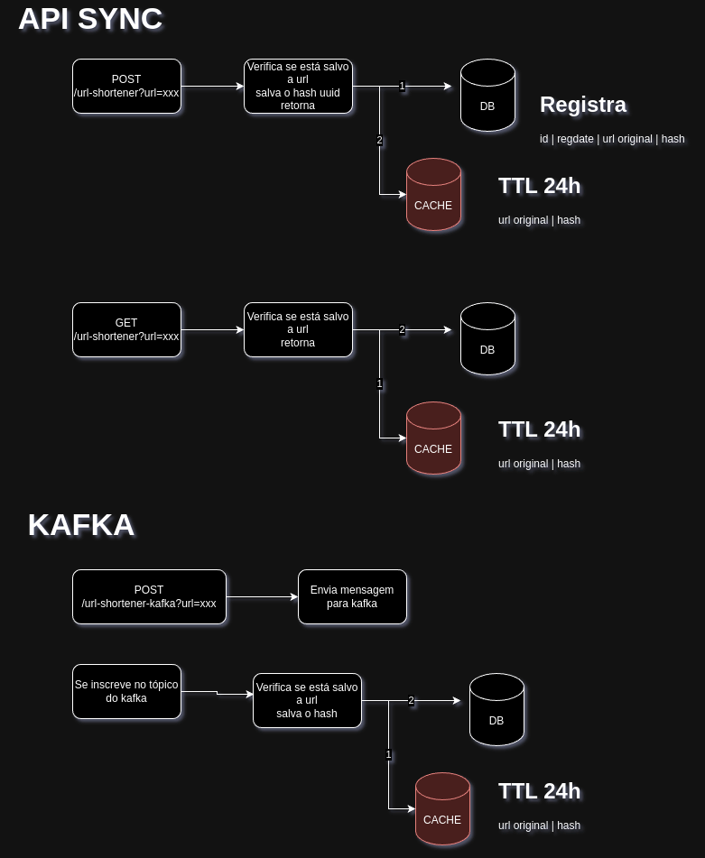

## Hash de Url Sync/Async

 O projeto consiste em um servidor HTTP que permite hashear URLs simulando um encurtador de urls de forma síncrona ou
assíncrona.

Endpoints

* POST
    * /url-shortener?url=xxx (cria uma nova URL e retorna de forma síncrona)
  * /url-shortener/kafka?url=xxx (encaminha a url para kafka)
      * Um listener do tópico no kafka recebe a mensagem e guarda no banco
* GET
    * /url-shortener?url=xxx (retorna a URL salva independente da forma como foi solicitada a criação.)

